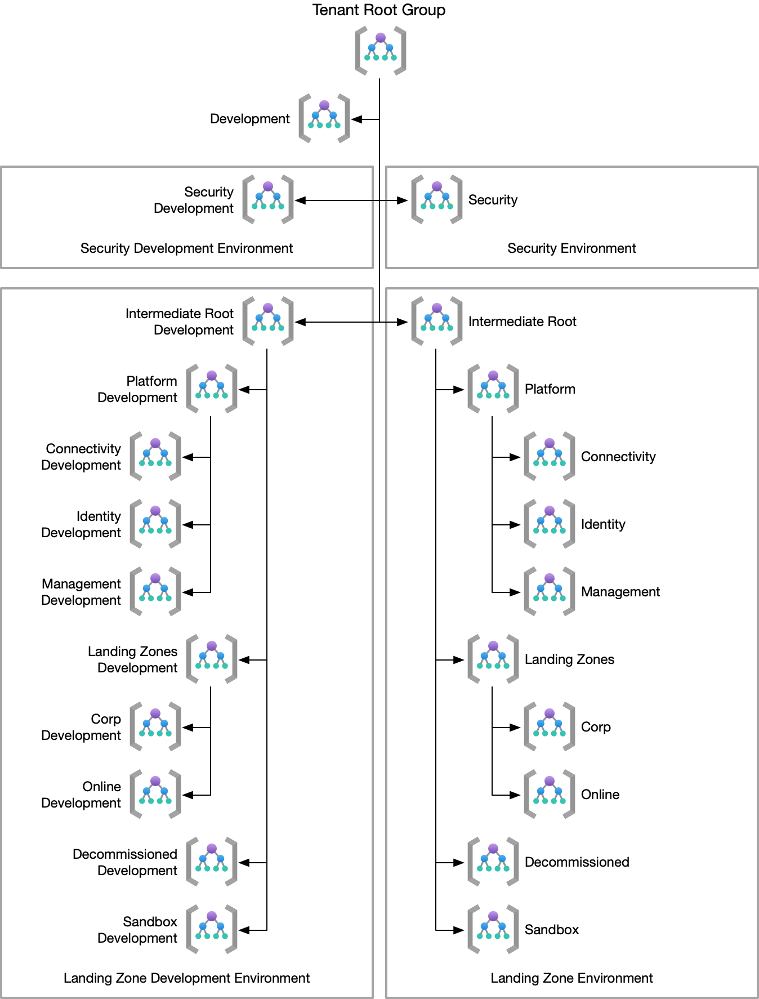

# Azure Policy Deployment with EPAC

This repository contains the necessary files to deploy Azure Policy with
Enterprise Policy as Code [EPAC][epac].

Included in this repository are scripts to import and update the [Enterprise
Scale][alz-policies] and [Azure Monitor Baseline Alerts][amba-policies]
policies.

## Management Groups

This template repository is based around a slightly customised version of the
standard [Microsoft Cloud Adoption Framework landing zone
architecture][caf-lz-arch]. The only modification is the addition of a
`Security` management group directly under the Tenant Root Group. This concept
is taken from the AWS Landing Zone architecture, and serves to allow for the
separation of security resources for both a policy and RBAC purpose. While this
repository includes the Security policy assignments, it would be trivial to move
them to a separate repository and update the `pacOwnerId` to separate the
management completely.

The intended Management Group hierarchy is as follows:

The `EPAC Dev` management group is intended to be used for policy deployments
during the pull-request workflow. This allows for the testing of policy changes
before they are merged into the main branch and deployed to the `Security` and
`Intermediate Root` management groups.

The assumption of the hierarchy is that the management group names meet the ALZ
standard naming conventions. The name of the intermediate root group is
prepended to the name of it's child management groups, separated with a hyphen.
All the development groups are named with a `dev-` prefix.

### Management Group Changes

If a customer has multiple tenants, the EPAC Development hierarchy could be
removed from the deployment. In this case, the development policies should be
deployed into the secondary tenant, which should have a matching management
group structure deployed. This would allow for greater testing, but the overhead
of maintaining multiple tenants should be considered.

## Global Settings

EPAC uses the `global-settings.jsonc` file to configure the deployments. This
repository has a default configuration that should be tweaked for the customer
needs. Contained within this file are a handful of text replacements that must
be made before the initial deployment. They are as follows:

- `|pacOwnerId|` - Replace with a GUID that represents the owner of the
  policies. If splitting the security policies into a separate repository, this
  GUID should be different for each repository.
- `|tenantId|` - Replace with the Entra tenant ID.
- `|IntermediateRootManagementGroup|` - Replace with the short name of the
  intermediate root management group.

## Policy Maintenance

Both the ALZ and AMBA policies are maintained by Microsoft. To make it easier to
keep these updated, there are pipelines for both GitHub and Azure DevOps which
will sync the latest policies from Microsoft and raise a pull request on `main`
if there are changes.

For this to work in GitHub, the "Allow GitHub Actions to create and approve pull
requests" permission to be enabled in the repository settings. This can be found
under "Actions" > "General" > "Workflow permissions".

[alz-policies]:
  https://aka.ms/alz/policies
  "Cloud Adoption Framework Azure Landing Zones Policies"
[amba-policies]:
  https://azure.github.io/azure-monitor-baseline-alerts/welcome/
  "Azure Monitor Baseline Alerts"
[caf-lz-arch]:
  https://learn.microsoft.com/en-us/azure/cloud-adoption-framework/ready/landing-zone/#azure-landing-zone-architecture
  "Azure Landing Zone Architecture"
[epac]:
  https://azure.github.io/enterprise-azure-policy-as-code
  "EPAC Documentation"
